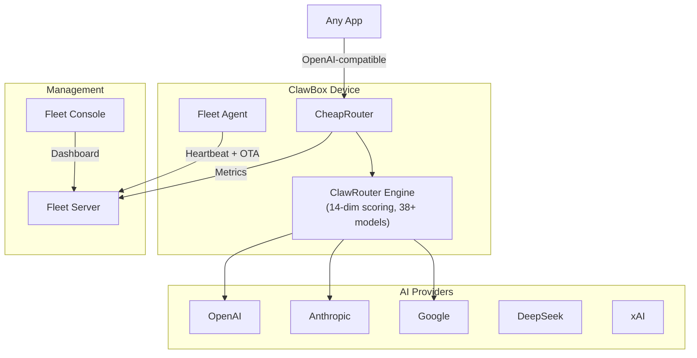

<p align="center">
  
</p>

<h3 align="center">Plug-and-play AI appliance powered by CheapRouter + Clawland-Fleet</h3>

<p align="center">
  <a href="https://github.com/Clawland-AI/OpenclawBox/actions/workflows/ci.yml"></a>
  <a href="https://openclawbox.ai"></a>
  <a href="LICENSE"></a>
  <a href="https://github.com/Clawland-AI/OpenclawBox/stargazers"></a>
</p>

---

**ClawBox** turns any machine into a personal AI appliance. One install command gives you an OpenAI-compatible API that intelligently routes across 38+ models, auto-recovers from provider failures, and costs up to 90% less than using a single premium model.

## Three Core Values

| | Value | What it means |
|---|---|---|
| **Cheaper** | Up to 90% cost reduction* | Smart routing sends simple queries to free/cheap models; only complex tasks hit premium |
| **Reliable** | Auto-failover | Provider down? Rate limited? ClawBox switches automatically — zero downtime |
| **Governed** | Fleet-managed | Device monitoring, OTA updates, rate limiting, and audit trails built in |

<sub>*In certain workloads with specific routing policies and model mixes. See <a href="https://openclawbox.ai/docs/benchmarks">Benchmarks</a> for methodology and reproduction steps.</sub>

---

## 60-Second Quickstart

**Step 1** — Install (one command):

```bash
curl -fsSL https://raw.githubusercontent.com/Clawland-AI/OpenclawBox/main/scripts/install.sh | bash
```

**Step 2** — Test the API:

```bash
curl http://localhost:4000/v1/chat/completions \
  -H "Content-Type: application/json" \
  -d '{"model": "blockrun/auto", "messages": [{"role": "user", "content": "Hello ClawBox!"}]}'
```

**Step 3** — Check your devices:

```bash
curl http://localhost:4100/api/devices
```

No API keys required — demo mode runs out of the box with a built-in mock provider.

> **Docker alternative**: `cd deploy && cp env.example .env && docker compose up -d`

---

## Architecture



---

## Key Features

### Unified API — Any model, one endpoint

CheapRouter exposes a standard OpenAI-compatible `/v1/chat/completions` endpoint. Any tool that works with OpenAI works with ClawBox — zero code changes.

```python
from openai import OpenAI
client = OpenAI(base_url="http://localhost:4000/v1", api_key="demo")
response = client.chat.completions.create(
    model="blockrun/auto",
    messages=[{"role": "user", "content": "Hello!"}],
)
```

[Docs: Unified API](https://openclawbox.ai/docs/unified-api)

### Auto Failover — Never crash on provider issues

Provider returns 429? 500? Timeout? ClawRouter's fallback chain tries the next model automatically. Your application sees a successful response.

[Docs: Auto Failover](https://openclawbox.ai/docs/auto-failover)

### Cost Reduction — Up to 90% savings

ClawRouter's 14-dimension scorer classifies each request (simple/medium/complex/reasoning) and routes to the cheapest capable model. Simple queries go to free models; only complex reasoning uses premium.

| Profile | Blended Cost | Savings vs Claude Opus |
|---|---|---|
| Eco | ~$0.10/M tokens | 98% |
| Auto | ~$2.05/M tokens | 92% |
| Premium | ~$25/M tokens | 0% |

<sub>Based on <a href="https://github.com/BlockRunAI/ClawRouter">ClawRouter</a>'s published pricing. Run `python benchmarks/run_bench.py` to reproduce.</sub>

[Docs: Benchmarks](https://openclawbox.ai/docs/benchmarks)

### Fleet Management — Monitor, configure, update

Clawland-Fleet gives you a web console to manage all your ClawBox devices:

- Device list with online/offline status
- Remote configuration push
- Over-the-air (OTA) updates
- Usage metrics and cost breakdown

[Docs: Fleet Management](https://openclawbox.ai/docs/fleet-management)

---

## Project Structure

```
packages/
  cheaprouter/       → CheapRouter (ClawRouter wrapper + fleet integration)
  fleet-server/      → Device management server
  fleet-agent/       → Device-side agent
  fleet-console/     → Web dashboard (React + Vite)
benchmarks/          → Reproducible cost/latency benchmarks
website/             → Documentation site (Docusaurus)
scripts/             → install.sh, clawboxctl
deploy/              → Docker Compose, env templates
```

---

## Powered by ClawRouter

CheapRouter's routing engine is [ClawRouter](https://github.com/BlockRunAI/ClawRouter) by BlockRunAI (MIT license, 3.3k+ stars). ClawRouter provides:

- 14-dimension weighted scoring for intelligent model selection
- 38+ models across 7 providers
- Routing profiles: eco / auto / premium / free
- Fallback chains with automatic retry
- Request deduplication and SSE heartbeat

CheapRouter adds fleet integration, device-level rate limiting, audit logging, and demo mode on top.

---

## Non-Affiliation Disclaimer

**Clawland Inc and ClawBox are independent open-source projects.** ClawBox is not affiliated with, endorsed by, or connected to any third-party hardware or software brand. This repository provides open-source reference implementations and developer tools. The "AI appliance" concept is an open hardware form factor — not a reference to any specific commercial product.

---

## Community

- [GitHub Discussions](https://github.com/Clawland-AI/OpenclawBox/discussions) — Questions, ideas, show & tell
- [Contributing](CONTRIBUTING.md) — How to contribute code, docs, and ideas
- [Roadmap](https://openclawbox.ai/docs/roadmap) — What's next and how to participate

---

## Roadmap Highlights

- **v0.2.0**: Authentication, real OTA, Prometheus metrics, device grouping
- **v0.3.0**: Semantic caching, multi-user, plugin system, ARM64 images
- **v1.0.0**: Touchscreen UI, QR pairing, mobile app, enterprise features

See the [full roadmap](https://openclawbox.ai/docs/roadmap).

---

## License

[Apache License 2.0](LICENSE) — Copyright 2026 Clawland Inc
