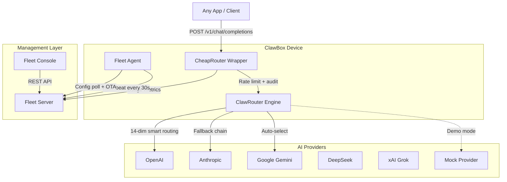
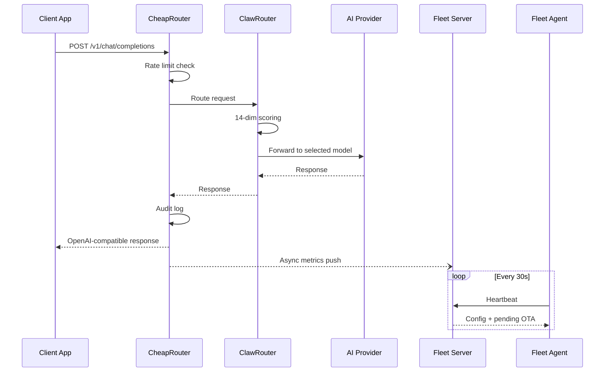

# Architecture

ClawBox consists of four main components working together to provide a complete AI appliance platform.

## System Overview

## Components

### CheapRouter (`packages/cheaprouter/`)

A thin integration layer wrapping [ClawRouter](https://github.com/BlockRunAI/ClawRouter) (by BlockRunAI). ClawRouter provides the heavy lifting:

- **14-dimension weighted scoring** for intelligent model selection
- **38+ models** across 7 providers (OpenAI, Anthropic, Google, DeepSeek, xAI, Moonshot, MiniMax)
- **Routing profiles**: eco (cheapest), auto (balanced), premium (best quality), free (zero cost)
- **Fallback chains** with automatic retry on provider errors
- **Request deduplication** to prevent double-charging

CheapRouter adds on top:

- **Device-level rate limiting** via `X-Device-ID` header
- **Audit logging** to SQLite (metadata only by default)
- **Fleet metrics bridge** forwarding usage data to Fleet Server
- **Demo mode** with a built-in mock provider for testing

### Fleet Server (`packages/fleet-server/`)

Central management server for all ClawBox devices.

- **Heartbeat tracking**: knows which devices are online/offline
- **Configuration distribution**: push routing profiles and settings to devices
- **OTA management**: trigger firmware/software updates
- **Metrics aggregation**: collects usage data from all CheapRouter instances

### Fleet Agent (`packages/fleet-agent/`)

Runs on each ClawBox device.

- **Heartbeat**: reports status to Fleet Server every 30 seconds
- **Config polling**: checks for configuration changes and applies hot-reloads
- **OTA handler**: receives update commands and executes them
- **Device identity**: generates and persists a unique device ID

### Fleet Console (`packages/fleet-console/`)

Web dashboard for fleet administrators.

- **Device list**: online/offline status, last heartbeat times
- **Device detail**: configuration editor, OTA trigger
- **Metrics**: request counts, token usage, cost breakdown, latency

## Data Flow

## Storage

All components use **SQLite** for local storage, keeping the deployment simple and self-contained.

| Component | Database | Contents |
|---|---|---|
| CheapRouter | `data/audit.sqlite` | Request audit logs (metadata only) |
| Fleet Server | `data/fleet.sqlite` | Devices, metrics, OTA jobs |
| Fleet Agent | `data/device-id.json` | Device identity |
