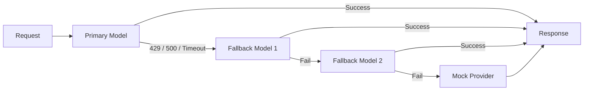

# Auto Failover

ClawBox automatically handles provider failures, rate limits, and timeouts without any manual intervention.

## How It Works

CheapRouter wraps ClawRouter's built-in fallback chain. When a request fails, it automatically retries with the next available model:



## Trigger Conditions

The fallback chain activates on:

| HTTP Status | Meaning | Action |
|---|---|---|
| 429 | Rate limited | Switch to next provider |
| 500 | Server error | Switch to next provider |
| 502 | Bad gateway | Switch to next provider |
| 503 | Service unavailable | Switch to next provider |
| 504 | Gateway timeout | Switch to next provider |
| Timeout | No response within limit | Switch to next provider |

## Demo: Simulating Failover

In demo mode, CheapRouter uses a mock provider that always succeeds. To test failover logic with real providers:

1. Configure multiple providers in ClawRouter
2. Set `DEMO_MODE=false`
3. Intentionally misconfigure one provider's API key
4. Send requests and observe the automatic switch

## Monitoring Failovers

Check the audit log for failover events:

```bash
curl http://localhost:4000/v1/audit?limit=10
```

Each audit entry includes the originally requested model and the model that actually served the response. A mismatch indicates a failover occurred.

## Health Tracking

ClawRouter tracks provider health using rolling success rates. Consistently failing providers are deprioritized in the routing decision, reducing the need for fallback on subsequent requests.

## Rate Limiting Protection

CheapRouter adds device-level rate limiting on top of provider-level protection:

- **Per-device RPM** (requests per minute): default 60
- **Per-device tokens per minute**: default 100,000

This prevents a single device from exhausting provider quotas that affect the entire fleet.
