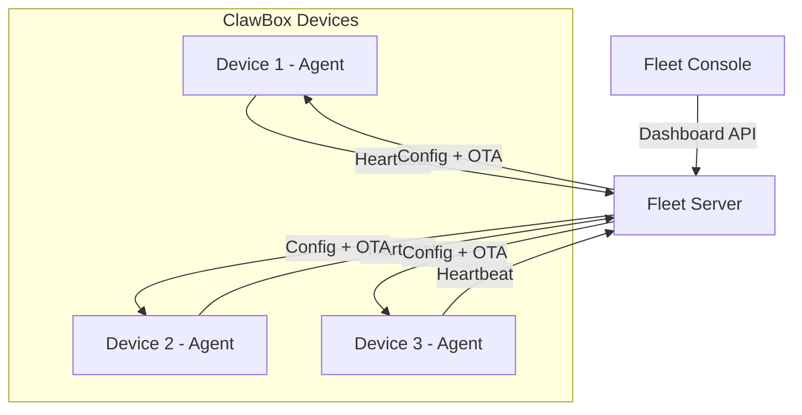

# Fleet Management

Clawland-Fleet provides device monitoring, configuration management, OTA updates, and usage auditing for ClawBox devices.

## Architecture



## Heartbeat

Each Fleet Agent sends a heartbeat to the Fleet Server every 30 seconds (configurable). The heartbeat includes:

- Device ID and name
- Software version
- Last error (if any)
- IP address

The server marks devices as **offline** if no heartbeat is received within 2 minutes.

### API

```bash
# List all devices
curl http://localhost:4100/api/devices

# Get single device
curl http://localhost:4100/api/devices/clawbox-abc123
```

## Configuration Management

Push configuration to devices remotely. Changes are picked up by the agent within 60 seconds (config poll interval).

### Push Config

```bash
curl -X PUT http://localhost:4100/api/config/clawbox-abc123 \
  -H "Content-Type: application/json" \
  -d '{
    "routingProfile": "eco",
    "rateLimit": { "rpm": 30 },
    "customSettings": { "timezone": "US/Pacific" }
  }'
```

### Hot Reload

The Fleet Agent detects config changes and applies them without restarting services.

## OTA Updates

Trigger over-the-air updates from the Fleet Console or API. The agent simulates the update process (download, apply, verify) and reports status back.

### Trigger OTA

```bash
curl -X POST http://localhost:4100/api/ota/trigger \
  -H "Content-Type: application/json" \
  -d '{"deviceId": "clawbox-abc123", "targetVersion": "0.2.0"}'
```

### Check Status

```bash
curl http://localhost:4100/api/ota/status?deviceId=clawbox-abc123
```

OTA states: `pending` → `completed` or `failed`

## Metrics & Auditing

CheapRouter forwards usage metrics to Fleet Server. View aggregated data:

```bash
# 24-hour metrics summary
curl http://localhost:4100/api/metrics
```

Response includes:
- Total requests, tokens, cost
- Average latency
- Breakdown by model and device
- Hourly activity

### Audit Logs

CheapRouter maintains a local audit log of all API requests:

```bash
curl http://localhost:4000/v1/audit?limit=50
```

**Privacy**: By default, only metadata is logged (model, token count, latency, device ID). Prompt content is **never stored** unless explicitly enabled in configuration.

## Device Identity

Each device generates a unique ID on first boot, stored in `packages/fleet-agent/data/device-id.json`. You can also bind a custom ID:

```bash
./scripts/clawboxctl bind my-clawbox-001 "Living Room"
```
